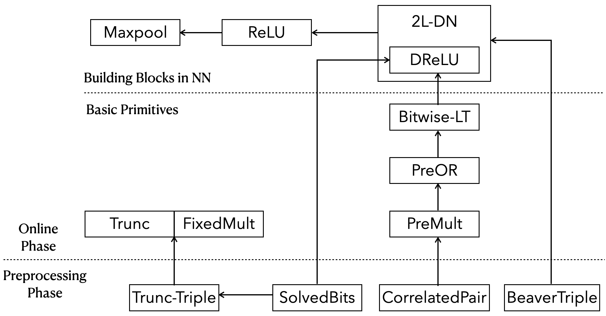

# Scalable Multi-Party Computation Protocols for Machine Learning in the Honest-Majority Setting
A general framework of scalable multi-party computation protocols for privacy-preserving inference, where the model is secret-shared among all data owners, with semi-honest security in the honest majority setting. This work has been accepted in [USENIX '24 Security](https://www.usenix.org/conference/usenixsecurity24) (in Summer Circle).

### Table of Contents
1. [Requirement](#requirement)
2. [Unit Tests](#unit-tests)
    1. [TL;DR](#tl-dr)
    2. [Unit Tests for Protocols](#unit-tests-for-protocols-mentioned-in-paper)
3. [Local Inference on a Single Machine](#local-inference-on-a-single-machine)
    1. [TL;DR](#tl-dr-1)
    2. [Functionality](#functionality)
    3. [Supported Settings](#supported-settings)
    4. [Output](#output)
    5. [Detailed Command Executed in Bash Script](#detailed-command-executed-in-bash-script)
4. [Remote Inference over Multiple Servers](#remote-inference-over-multiple-servers)
    1. [Traffic Control to Simulate LAN and WAN](#trafic-control-to-simulate-lan-and-wan)
    2. [Separate Execution with Scripts](#separate-execution-with-scripts)

## Requirement 

This code should work on macOS and most Linux distributions.

- It has been developed and tested with macOS Ventura 13.5 with Intel processors.
- The experiments in the paper are conducted with Ubuntu 20.04 LTS and 22.04 LTS.

We **recommend readers compile and run the program on Linux** since we do not test in MacOS with Apple Silicon.

Requirement packages:

- g++ or clang
- cmake
- make
- OpenSSL
- libsodium library
- Eigen library

On Linux:

```shell
sudo apt update

# install cmake openssl libsodium tc 
# tc (traffic control) is used to simulate LAN & WAN
sudo apt install -y build-essential cmake libssl-dev libsodium-dev iproute2 
```
We have added the Eigen's header files in our artifact, located in `Eigen/` subdirectory, which are the only required files to compile with Eigen.

We **strongly recommend** readers to compile and run the program on Linux machines since we do not fully test the configurations on other platforms. 
On macOS, this requires brew to be installed.
```shell
make mac-setup
```


## Unit Tests

### TL; DR

We provide unit tests to check that all required dependencies are installed and the functioning are fine.

- Test communication module

  ```shell
  make -j8 network
  ```

- Test math module

  ```shell
  make -j8 eigen
  ```

- Test protocol module

  ```shell
  ./test_unit.sh Fixed-Mult
  ```

  It will conduct a unit test for the fixed-point multiplication in the setting of 3PC with the threshold $t=1$. The script is located in `Scripts/test_unit.sh` .

```
# Usage: ./test_unit.sh [test_name]
./test_unit.sh Fixed-Mult
```

### Unit Tests for Protocols Mentioned in Paper

We support many unit tests, enabling readers to easily catch how these primitive protocols work and to modify the source code.

The following tests correspond to the protocols mentioned in the paper.

- `Trunc` : for Protocol 3.1 Trunc
  It tests for the multiplication between **secret** fixed-point numbers and **public** fixed-point numbers, i.e. it only performs **a pure truncation**.

- `Fixed-Mult` : for Protocol 3.2 Fixed-Mult

  It tests for the multiplication between **secret** fixed-point numbers.

- `PreOR` : for Protocol 4.1 PreOR

  It tests for computing the prefix-OR over **shared bits**.

- `Bitwise-LT` : for Protocol 4.2 Bitwise-LT

  It tests for computing the result of bitwise less-than, given two bitwise sharings.

- `DReLU` : for Protocol 5.1 DReLU

  It tests for computing the derivation of ReLU of secret numbers, i.e. the sign bit.

- `ReLU`: for Protocol 5.3 ReLU

  It tests for computing the ReLU of secret numbers.

- `Maxpool`: for Protocol 5.4 Maxpool

  It tests for computing the Maxpool and its derivation of a vector of sharings.

## Local Inference on a Single Machine

### TL; DR

It will make an inference on a 3-layer DNN in the setting of 3PC with the threshold $t=1$.

```shell
# Usage: ./Scripts/inference.sh <npc>
./Scripts/inference.sh 3
```

This script, located in `Scripts/inference.sh`, is only recommended for testing the functionality of the inference since it only simulates $n$ parties locally.

Each party occupies different port numbers in the local IP address `127.0.0.1`. They execute the MPC protocol described in `ML/inference.cpp`. 

The output of the terminal is defaulted to P0's output.

### Functionality

First of all, let's see what happens in the protocol described in `ML/inference.cpp` . It simulates 3 parties on a single machine and makes an inference. 

The functionality of the program `ML/inference.cpp`  is as follows:

1. Read the IP file to know the number of parties involved in the computation and build communication channels for each pair of parties. The communication backend is slightly modified from [MP-SPDZ](https://github.com/data61/MP-SPDZ). 

   *When we conduct the inference locally, the IP file is auto-generated in the file located in `Inference/IP_HOSTS/IP_LOCAL` according to the number of parties.
   But when we conduct the experiment in LAN or WAN, the IP file includes the IP and port number of each party, e.g. the IP file for `11C` located in `Inference/IP_HOSTS/IP_11`.*
2. Build the neural network instance of the specified setting, including the network configuration, the dataset, the batch size, and so forth. The neural network frontend is slightly modified from [Falcon](https://github.com/snwagh/falcon-public).

   *E.g., `Inference/SecureML` subdirectory contains the configuration information of a 3-layer DNN, including:*

   - *`Inference/SecureML/input`: input of the NN, including 128 input points excerpted from MNIST dataset.*
   - *`Inference/SecureML/preload` : contains the weight value and bias value of each layer. We will preload these weights and then perform the inference.*
   - *`Inference/SecureML/output` : contains the output of each layer, which is trained by PyTorch in Falcon.*
3. Generate randomness (i.e. various random sharings) in the preprocessing/offline phase that will be used in the online phase. The number of each kind of random sharings is specified in a file.

   E.g. The file  `Inference/SecureML/offline/PR31_offline_b1.txt` specifies the required number of various random sharings when `TEST_DATA_SIZE=1` and the finite field is $p=2^{31}-1$ .
4. Perform an inference over the network in the online phase.
5. Output the statistical data of the preprocessing phase and online phase, including the time and communication size.

### Supported Settings 

You can modify the scripts `/Scripts/inference.sh` to execute the private-preserving inference in different settings.

First of all, you can use this script to simulate any arbitrary parties of **odd numbers** on one terminal.

```shell
./Scripts/inference.sh <npc>
```

For ease of programming, we demand the number of parties $n$ is an odd number and the threshold is fixed to $t=(n-1)/2$.

But we **DO NOT** recommend that you simulate a large number of parties in a single computer that may lead to a crash due to the limited resources. 

Other modifiable settings are as follows:

- `TEST_DATA_SIZE=1`  

  Although it supports inputs of any size, we only precompute the number of required randomness for `TEST_DATA_SIZE=1`  and `TEST_DATA_SIZE=8`.  If you want to test for inputs of other sizes, we recommend you set `TRUE_OFFLINE=0` at first to obtain the number of required random sharings. 

- `PRIME=PR31` : Specified arithmetic field over a Mersenne prime.

  - `PR31` : Mersenne prime $2^{31}-1$.
  - `PR61` : Mersenne prime $2^{61}-1$.

- `Network=SecureML`
  - `SecureML`: a 3-layer DNN corresponding to Network-A in the paper.
  - `Sarda` : a 3-layer CNN corresponding to Network-B in the paper.
  - `MiniONN` : a 4-layer CNN corresponding to Network-C in the paper.

- `DATASET=MNIST` 

  We only support MNIST dataset right now.

- `TRUE_OFFLINE=1`

  We'd like to elaborate on the meaning of true offline defined here.

  - `1` : It generates all required randomness in a truly preprocessing phase, which is completely separate from the online phase.  However, it needs to specify the number of different randomness **in advance**. The number is relative to the computation program (`NETWORK`), the size of the input (`TEST_DATA_SIZE`), and the bit length of the computation domain (`PRIME`). We have to precompute them and store them in a file specified by the argument `OFFLINE_ARG`. Honestly, the exact number of the required randomness is computed and outputted in `TRUE_OFFLINE=0` mode.

  - `0`: It generates the required randomness on demand. In this setting, the whole computation alternates between the preprocessing phase and the online phase. We maintain the timer of running time and counter of communication bytes for each phase. As a result, when it is required to generate some randomness, it switches to the preprocessing phase, resuming the corresponding timer and counter. Then it switches to the online phase to continue the remaining computation.

### Output

We provide two kinds of outputs for different purposes.

- When setting ` TRUE_OFFLINE=0`, we want to collect detailed statistics, including the time and communication bytes **for each party**. (You can refer to [Detailed Command Executed in Bash Script](#detailed-command-executed-in-bash-script) to run the program in separate terminals to output the detailed statistics of each party.) Moreover, we want to collect the number of various random sharings required in the whole protocol. Having the number of random sharings enables us to conduct the experiments with a separate offline.
- When setting ` TRUE_OFFLINE=1` with the provided number of random sharings, it seems to conform to the real scenarios. Hence, we want to collect more data points to analyze the efficiency. Recall that the **communication complexity is measured by the number of field elements sent by each party.** Hence, the **statistics of communication size outputted in this setting is rather an average of the communication bytes sent by all parties** than the raw data of some specific party. You can check the code to validate it.

It is worth noting that the usage of `./Scripts/inference.sh 3 NETWORK=Sarda` is **not supported**. You **must modify the bash scripts by hand, and then run the modified script.**  Otherwise, the options specified in the command won't take effect.

Here we illustrate several examples with different settings.

#### TRUE_OFFLINE=0

As described above, we can use the bash scripts (`Scripts/inference.sh`) to run the program in a single terminal.

Here I copy the incomplete script to demonstrate the configuration we set.

Incomplete Script:

```bash
# Command: ./Scripts/inference.sh 3
# Make an inference in the setting of 3PC with the following settings.

MAX_PLAYERS=$1
TEST_DATA_SIZE=1
# PRIME = {PR31, PR61}
PRIME=PR31
# NETWORK = {SecureML, Sarda, MiniONN}
NETWORK=SecureML
# Dataset = {MNIST}
DATASET=MNIST
# True Offline: 
TRUE_OFFLINE=0
CORES=4
```

The output consists of two parts, the offline part and the online phase. The statistical data is **of P0 by default**, including the time, the communication size, and the number of rounds. 

Note that the number of rounds here is different from the round complexity mentioned in the paper, which here indeed counts the number of sending a message.

Output: (P0's output in the terminal by default)

```text
---OFFLINE----
Time (for P0) = 0.008551 seconds
Data sent (for P0) = 0.287812 MB in ~29 rounds
Global data sent = 0.957904 MB (all parties)
Preprocessed Randomness:
#Random = 32054
#DoubleR = 16128
#RandomBit = 16182
#RandomUn = 256 31
#RandomTrunc = 0
#RandomReTrunc = 266
-------------
---ONLINE---
Time (for P0) = 0.001594 seconds
Data sent (for P0) = 0.050928 MB in ~18 rounds
Global data sent = 0.142496 MB (all parties)
-------------
Execution completed
```

It also counts the number of different random sharings required in the online phase.

- #Random: number of random sharings
- #DoubleR: number of double random sharings
- #RandomBit: number of random bits
- #RandomUn: number of random correlated pairs for unbounded multiplications
- #RandomTrunc: number of truncation triples for pure truncation
- #RandomReTrunc: number of truncation triples for fixed-point multiplication



Having the number enables us to generate all required randomness in the preprocessing phase.


#### TRUE_OFFLINE=1

Incomplete Script:

```bash
# Command: ./Scripts/inference.sh 3
# Make an inference in the setting of 3PC with the following settings.

MAX_PLAYERS=$1
TEST_DATA_SIZE=1
# PRIME = {PR31, PR61}
PRIME=PR31
# NETWORK = {SecureML, Sarda, MiniONN}
NETWORK=Sarda
# Dataset = {MNIST}
DATASET=MNIST
# True Offline: 
TRUE_OFFLINE=1
CORES=4

IP_FILE=Inference/IP_HOSTS/IP_LOCAL
BASE_FILE=Inference/$NETWORK
Output_file=$BASE_FILE/$NETWORK.P0
OFFLINE_ARG=$BASE_FILE/offline/${PRIME}_offline_b$TEST_DATA_SIZE.txt

# ommited

# You can change the number of iterations to collect more data points, each of which is a complete execution of the protocol. 
for ((k=1; k<=1; k=k+1)); do
    if test $TRUE_OFFLINE = "1"; then
        echo "[Note: onlineTime and offlineTime measure the time of P0 by default.]"
        echo "[Note: onlineComm, offlineComm, and allComm measure the average communication bytes of all parties.]"
        echo "onlineTime onlineComm offlineTime offlineComm allComm"
    fi
    one_iteration
done
```

In the setting of `TRUE_OFFLINE=1` , the output is much simpler. If you want to conduct multiple independent runs in one command, you can directly change the number of iterations to collect more data points, each of which is a complete execution of the protocol, as shown above.

  ```text
[Note: onlineTime and offlineTime measure the online and offline time of P0 by default, respectively.]
[Note: onlineComm, offlineComm, and allComm measure the average of communication bytes sent by all parties.]
onlineTime onlineComm offlineTime offlineComm allComm
0.005609 0.200213 0.02477 1.33976 1.53997
Execution completed
  ```


### Detailed Command Executed in Bash Script

To show what happens in the bash script, I rewrite the detailed command of the setting of 3PC in the Makefile. You can modify the options in the Makefile as usual and use `make -j8 terminal` to execute the following commands in one terminal, which simulates three parties and only outputs P0's results in the terminal.

Note that the usage of `./Scripts/inference.sh 3 NETWORK=Sarda` or `make -j8 terminal NETWORK=Sarda` is **not supported**. You **must modify the options in Makefile by hand, and then 'make' it.**  Otherwise, the options specified in the command won't take effect.

Incomplete Makefile:

```makefile
# Makefile
# usage: make -j8 terminal
MAX_PLAYERS=3
THRESHOLD=1
TEST_DATA_SIZE=1
PRIME=PR31# {PR31, PR61}
NETWORK=SecureML# {SecureML, Sarda, MiniONN}
DATASET=MNIST# {MNIST}
TRUE_OFFLINE=0
CORES=4
NET=LAN

terminal: inference.x
	./inference.x 2 $(IP_FILE) $(THRESHOLD) $(NETWORK) $(DATASET) $(TEST_DATA_SIZE) $(TRUE_OFFLINE) $(OFFLINE_ARG) $(CORES) > /dev/null &
	./inference.x 1 $(IP_FILE) $(THRESHOLD) $(NETWORK) $(DATASET) $(TEST_DATA_SIZE) $(TRUE_OFFLINE) $(OFFLINE_ARG) $(CORES) > /dev/null &
	./inference.x 0 $(IP_FILE) $(THRESHOLD) $(NETWORK) $(DATASET) $(TEST_DATA_SIZE) $(TRUE_OFFLINE) $(OFFLINE_ARG) $(CORES)
	@echo "Execution completed"
```
You can also execute these commands in three separate terminals and output the results of each party.

```makefile
# Makefile

# make -j8 zero
zero: inference.x
	./inference.x 0 $(IP_FILE) $(THRESHOLD) $(NETWORK) $(DATASET) $(TEST_DATA_SIZE) $(TRUE_OFFLINE) ${OFFLINE_ARG} ${CORES}
	@echo "Execution completed"

# make -j8 one
one: inference.x
	./inference.x 1 $(IP_FILE) $(THRESHOLD) $(NETWORK) $(DATASET) $(TEST_DATA_SIZE) $(TRUE_OFFLINE) ${OFFLINE_ARG} ${CORES}
	@echo "Execution completed"

# make -j8 two
two: inference.x
	./inference.x 2 $(IP_FILE) $(THRESHOLD) $(NETWORK) $(DATASET) $(TEST_DATA_SIZE) $(TRUE_OFFLINE) ${OFFLINE_ARG} ${CORES}
	@echo "Execution completed"

```

In the settings of a large number of parties, it is inconvenient to enter such tedious commands in the terminal. That's why we use the bash script to facilitate the experiments with different settings.

## Remote Inference over Multiple Servers

A single server has such limited computation and communication sources that it is hard to simulate a large number of parties, e.g. 31PC, 63PC.

Hence, we conducted our real experiments on several servers to simulate a large number of parties, giving us reliable results.

In the setting of 3PC, 7PC, and 11PC, a single party controls a single server.

In the settings of 21PC, 31PC, and 63PC, we run multi-parties on a single server simultaneously with different ports. As mentioned in Appendix D of the paper, we guarantee the number of parties on different servers differs by up to one for load balancing. The assignment is reflected in the IP file. All IP files are located in `Inference/IP_HOSTS`.

### Traffic Control to Simulate LAN and WAN

We use the Linux `tc` command to set the latency and the bandwidth.

For the **LAN setting**, we need to set the latency on the local loopback NIC (Network Interface Controller) for parties **on the same server**, ensuring that the ping time for each pair of parties is almost consistent.

```shell
# Set latency on the local NIC
sudo tc qdisc add dev lo root netem delay 0.13ms 
```

For the WAN setting, we need to set the latency on the NIC **with regard to the IP address for parties on the different servers** and the **local loopback NIC for parties on the same server.** You can run the mini script to check the ping time for each pair of parties. Besides, we need to set the bandwidth for the corresponding NIC.

```shell
# Set latency and bandwidth on the local NIC
sudo tc qdisc add dev lo root netem delay 20ms rate 100mbit 
# Set latency and bandwidth on the NIC with regard to the IP address
sudo tc qdisc add dev eno1 root netem delay 20ms rate 100mbit 
```

### Separate Execution with Scripts

We also support various scripts to facilitate the separate execution with different settings.

All scripts are located in `Scripts/infer-<npc>`  for $n=3,7,11,21,31,63$ .

Let me show the details of how to conduct the experiment for `7pc` with 7 separate servers.

1. Prepare 7 servers with requirements installed, and separately compile `inference.x`. Then run the above command to perform the inference locally to ensure the environment is ready.

   ```shell
   make -j8 inference.x
   
   ./Scripts/inference.sh 3
   ```

2. Use `tc` to set latency and bandwidth to simulate the LAN or WAN.

3. Modify the IP file `Inference/IP_HOSTS/IP_7` to assign the IP of each server to the corresponding party. You can also assign the port numbers in the form of `IP:port number`.

4. For each separate server, run the script `./Scripts/infer-7pc/inference_7pc.sh <id>`. With such a script, it allows us to run the same program with different options by just modifying the corresponding script while only compiling once. Note that `<id>` stats from `0`  to `6`, which must correspond to the assignment specified in the IP file.

   ```shell
   ./Scripts/infer-7pc/inference_7pc.sh 0 # Server 0
   ./Scripts/infer-7pc/inference_7pc.sh 1 # Server 1
   ./Scripts/infer-7pc/inference_7pc.sh 2 # Server 2
   ./Scripts/infer-7pc/inference_7pc.sh 3 # Server 3
   ./Scripts/infer-7pc/inference_7pc.sh 4 # Server 4
   ./Scripts/infer-7pc/inference_7pc.sh 5 # Server 5
   ./Scripts/infer-7pc/inference_7pc.sh 6 # Server 6
   ```

5. Modify the script to execute the protocol with a different setting. Besides the options mentioned above, the other options include

   - Aforementioned Options:
     -  `PRIME=PR31` 
     - `TEST_DATA_SIZE=1`
     - `NETWORK=SecureML`
     - `DATASET=MNIST`

   - `NET=WAN`:   Conduct the experiment in the WAN setting.

   - `CORES=16`: Control the number of threads for Eigen's algorithms with the use of multi-threading.

   - `IP_FILE=Inference/IP_HOSTS/IP_$NPC` : The default location in this example is `Inference/IP_HOSTS/IP_7`. 

   - `OFFLINE_ARG=`: The location of the file, which specifies the number of various random sharings required to be generated in the preprocessing phase.  We precompute it for some settings, stored in the following location.

     ```bash
     OFFLINE_ARG=Inference/$NETWORK/offline/${PRIME}_offline_b$TEST_DATA_SIZE.txt
     # In this example, the default location is Inference/SecureML/offline/PR31_offline_b1.txt
     ```

   - `Output_file=` : The location of the output file. In order to ensure reliable results, a single execution contains 10 independent runs. For simplicity, we only collect the output of P0's. The default location is set to 

     ```bash
     Output_file=Inference/$NETWORK/test${PRIME}/${NET}/${NETWORK}.b${TEST_DATA_SIZE}_${NPC}PC
     # In this example, the default location is Inference/SecureML/testPR31/WAN/SecureML.b1_7PC
     ```

All the raw data points of the Table 2-5 figured in the paper are collected in the Excel Tables located in:

- `Tables/hmmpc-experiment-LAN(PR31).xlsx` : raw data points in the LAN setting
- `Tables/hmmpc-experiment-WAN(PR31).xlsx`: raw data points in the WAN setting
- `Tables/Comparison-with-Falcon.xlsx` : raw data points of Falcon with the same setting

Note that all the raw data points in the Excel tables are collected in the setting of `TRUE_OFFLINE=1` where the random sharings are generated in a separate pre-processing phase totally before the online phase, and the communication size is the average of the communication bytes sent by all parties. 

Hence, if you want to reproduce the result, you need to set `TRUE_OFFLINE=1`.
